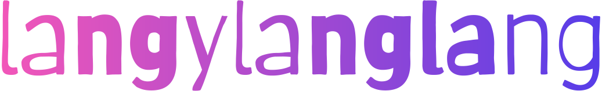

<div align="center">
  
</div>
<br>


[](https://npmjs.org/package/langylanglang)
[](https://npmjs.org/package/langylanglang)
[](https://github.com/RichardLitt/standard-readme)
[](https://npmjs.org/package/langylanglang)
[](http://makeapullrequest.com)

> Localize your interface

## Table of Contents

- [Usage](#usage)
- [Install](#install)
- [Contribute](#contribute)
- [License](#license)

## Usage

```js
import { set, onMissingKey, t, locale, fallback } from './langylanglang'

set('en', {
  greeting: 'Hi {bar}! how are you?',
  info: 'Bye buddy!'
})

set('za', {
  greeting: 'Hi {bar}! Hoe gaan dit my bra?',
  info: 'Cheers tjom!'
})

// Can also set multiple
// set({
//   'en': {
//     greeting: 'Hi {bar}! how are you?',
//     info: 'Bye buddy!'
//   },
//   {
//     greeting: 'Hi {bar}! Hoe gaan dit my bra?',
//     info: 'Cheers tjom!'
//   }
// })

onMissingKey((...args) => {
  console.log('Got missing key', args)
  return ''
})

console.log(
  t('greeting', {
    bar: 'Tiaan',
    bing: 'mcface'
  })
)

console.log(t('info'))

locale('za')

console.log(
  t('greeting', {
    bar: 'Tiaan',
    bing: 'mcface'
  })
)

console.log(t('info'))
```


## Install

This project uses [node](https://nodejs.org) and [npm](https://www.npmjs.com).

```sh
$ npm install langylanglang
$ # OR
$ yarn add langylanglang
```


## Contribute

1. Fork it and create your feature branch: `git checkout -b my-new-feature`
2. Commit your changes: `git commit -am "Add some feature"`
3. Push to the branch: `git push origin my-new-feature`
4. Submit a pull request

## License

MIT
